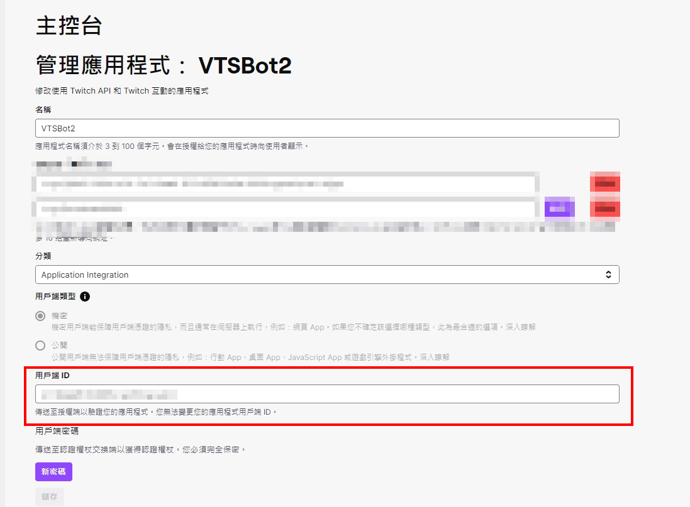
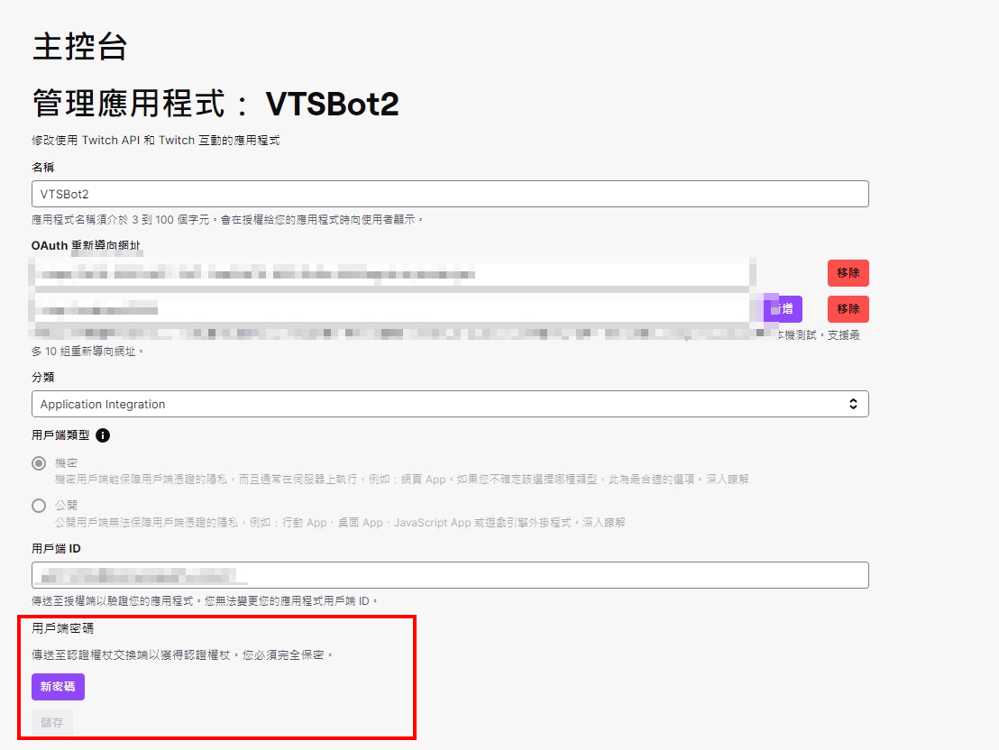
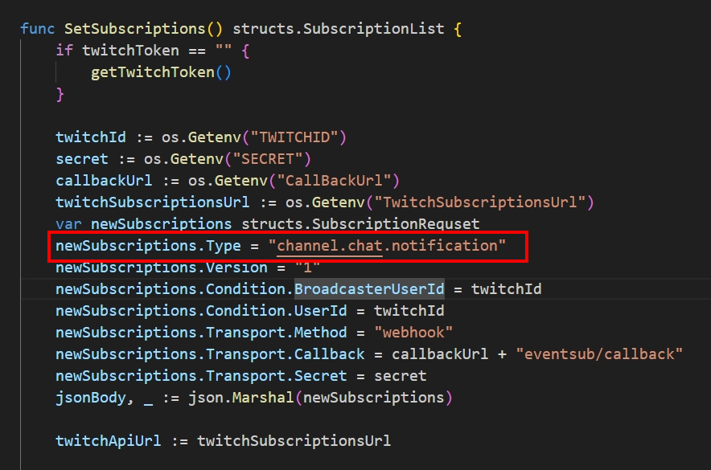

# twitch webhook大略文件

# ClientId
-   網址: https://dev.twitch.tv/console
-   裡面的用戶端ID就是ClientId
-   

# ClientSecret
-   網址: https://dev.twitch.tv/console
-   裡面的用戶端密碼就是ClientSecret!
-   密碼本身不要洩漏，可以寫在code裡面，但是不要讓人知道

# CallBackUrl
-   這個是因為Twitch eventsub api他會收到訊息之後呼叫你寫好的POST API，所以需要先建立一個server端來接收訊息

# TwitchSubscriptionsUrl & TwitchTokenUrl
-   Token那邊是取得授權的網址，參考資料如下
-   https://dev.twitch.tv/docs/authentication/
-   如果要用不同的範圍(scope)，先從Implicit grant flow開始，會開啟一個網站認證
-   再去使用裡面寫的function getTwitchToken，填好URL就可以取得授權Token
-   TwitchSubscriptionsUrl主要就是呼叫我裡面寫的三支API，可以取得已經訂閱的event或是刪除沒有用到的event，最後是新增event

# 新增不同的type
-   這邊可以新增不同type的event，參考的type在官網文件中，但不同的type需要的帳號授權等級不同，可能要看訊息來檢查
-   https://dev.twitch.tv/docs/eventsub/eventsub-subscription-types/
-   